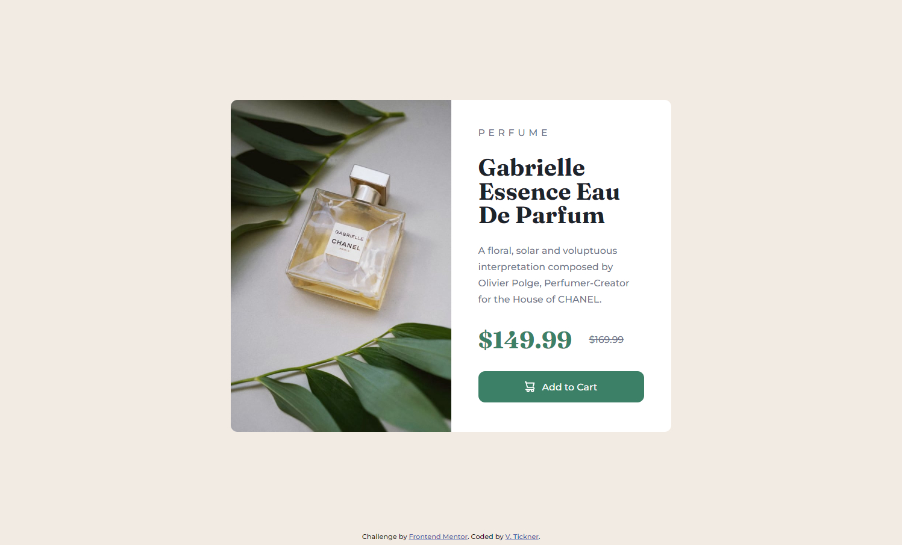

# Frontend Mentor - Product preview card component solution

This is a solution to the [Product preview card component challenge on Frontend Mentor](https://www.frontendmentor.io/challenges/product-preview-card-component-GO7UmttRfa).

## Table of contents

- [Overview](#overview)
  - [Screenshots](#screenshots)
  - [Links](#links)
- [My process](#my-process)
  - [Built with](#built-with)
  - [What I learned](#what-i-learned)
  - [Continued development](#continued-development)
  - [Useful resources](#useful-resources)
- [Author](#author)

## Overview

The challenge was to build a responsive layout to show a product preview card component and get the design to look as close as possible to the provided design images. It also included using a hover state for the button.

### Screenshots




### Links

- Solution URL: [https://github.com/VTickner/frontend-mentor-product-preview-card-component](https://github.com/VTickner/frontend-mentor-product-preview-card-component)
- Live Site URL: [https://vtickner.github.io/frontend-mentor-product-preview-card-component/](https://vtickner.github.io/frontend-mentor-product-preview-card-component/)

## My process

- Created semantic HTML first
- Created CSS selectors to:
  - create custom variables to contain the various colours, font sizes font weights used in the design
  - used a CSS reset
  - layout the design using Grid and Flexbox
  - style the various elements, adding in a hover state for the button
  - added in `:focus` styling for accessibility purposes
  - create a different width layout for mobile version turning the card component into a column

### Built with

- Semantic HTML markup
- CSS custom properties
- Grid
- Flexbox
- Desktop-first workflow (responsive design)
- Google Fonts

### What I learned

I learnt how to switch images based on screen size using the `picture` and `source` tags:

```html
<picture>
  <source
    media="(max-width: 43.75em)"
    srcset="./images/image-product-mobile.jpg"
  />
  <source srcset="./images/image-product-desktop.jpg" />
  
</picture>
```

### Continued development

Gain more practice by creating more designs that have a more complicated layout.

### Useful resources

- [Google Fonts](https://fonts.google.com/) - The fonts used in this design were [Montserrat](https://fonts.google.com/specimen/Montserrat) using Medium 500 and Bold 700 font styles along with [Fraunces](https://fonts.google.com/specimen/Fraunces) using Bold 700 font style.

## Author

- Frontend Mentor - [@VTickner](https://www.frontendmentor.io/profile/VTickner)
